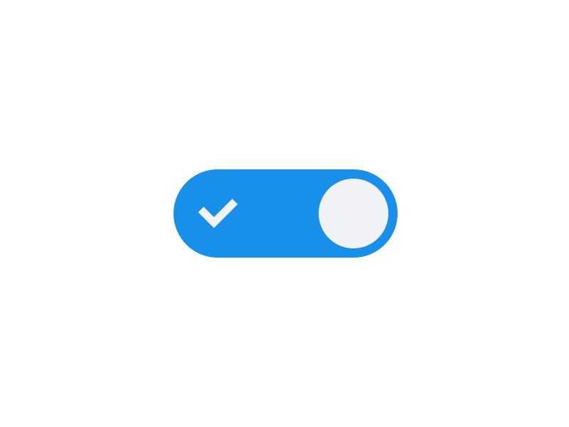

## Today's Topics

- Implementing search in your application 🔍
- Query Strings: What are they and why do we need them? 🤔
- Toggling in React 

## 🎯 Project: Questionbox

Continue pushing forward on Questionbox! 💥🚀

By now your project should include:
- Login and Registration
- Ability to approve answers on questions
- Full CRUD functionality for questions
- CRUD functionality for answers

## 🎙️ Phase 2 Presenation

Your phase 2 presentation will be held **this Thursday** at 10:30a EST. You will each have 4-5 minutes to speak about Questionbox. Below are the topics we would like for you to cover:

1. Walk us through the routes in your application at the `App.js` level and please choose one route to discuss in detail.
 - How are you passing data through your route?
 - Do any of your routes return a redirect? How does that work?

2. What is your favorite feature and why? 

3. Give an example of a `useEffect` in your code and explain what it is doing. 

## 📖 Read | 📺 Watch | 🎧 Listen

- [What Are HTTP Query Params?](https://www.youtube.com/watch?v=iH5TMSB_aDo)
- [How to Build a Search Bar in React](https://www.emgoto.com/react-search-bar/)
- [Toggle State in React](https://dommagnifi.co/2020-12-03-toggle-state-with-react-hooks/)